<p align="center">
  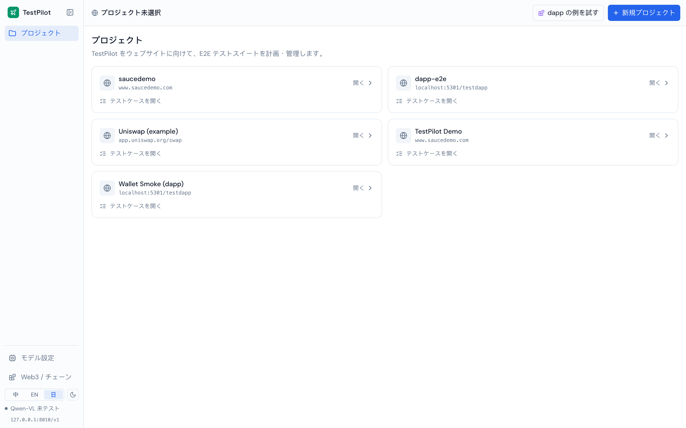
</p>

<h1 align="center">TestPilot</h1>

<p align="center">
  <b>Web アプリと Web3 dapp のための、AI 駆動 E2E テストプラットフォーム。</b><br>
  URL を渡すだけ — AI がフローを探索し、実際の UI を操作し、決定的な判定を返します。
</p>

<p align="center">
  <a href="README.md"></a>
  <a href="README.en.md"></a>
  <a href="README.ja.md"></a>
</p>

<p align="center">
  
  
  
  
</p>

---

## 目次

- [TestPilot とは](#testpilot-とは)
- [主な機能](#主な機能)
- [機能ツアー（スクリーンショット付き）](#機能ツアースクリーンショット付き)
- [アーキテクチャ](#アーキテクチャ)
- [実行パイプライン](#実行パイプライン)
- [Dapp / Web3 テスト](#dapp--web3-テスト)
- [AI モデル依存](#ai-モデル依存)
- [ローカル開発](#ローカル開発)
- [技術スタック](#技術スタック)
- [ディレクトリ構成](#ディレクトリ構成)
- [ロードマップ](#ロードマップ)

---

## TestPilot とは

TestPilot は「部門まるごとの自動テスト業務」を AI に任せます:

1. **探索** — URL を渡すと、視覚言語モデルがページを理解し、**P0/P1/P2 の優先度**とビジネス上の理由付きでテストケースを提案します。
2. **実行** — [Midscene](https://midscenejs.com/) が**実ブラウザ**を、自然言語のステップで実際の UI に対して操作します（セレクタ不要）。
3. **判定** — 各実行は**二重オラクル**を使用: 機能アサーション（視覚）＋決定的チェック（オンチェーン／パフォーマンス／ビジュアルベースライン）。
4. **運用** — スイート実行、CI ゲート、自己修復リトライ、フレーク統計、トレンドダッシュボード、実行可能コードのエクスポート。

録画リプレイや手書きセレクタと違い、ケースは自然言語で表現されるため、UI の小さな変更で一斉に壊れません。判定はできるだけ決定的なシグナル（トランザクション receipt、ピクセルベースライン、パフォーマンス予算）に寄せ、脆い視覚判定と信頼できる結果判定を分離します。

> **Web3 dapp E2E を第一級で重視。** ユーザーは dapp の UI を操作します。その操作の最終的な真実は「ウォレットに成功トランザクションが 1 件増えた」ことです。TestPilot は注入型の仮想ウォレットでウォレットのポップアップを自動承認し、その tx receipt を第一級のアサーションにします — UI をバイパスすることは一切ありません。

---

## 主な機能

| 機能 | 内容 |
|---|---|
| 🧭 **AI 探索** | 視覚モデルがサイトを理解 → 理由付き・優先度付きのケースを生成。ディープクロールと「Dapp モード」に対応 |
| ⌨️ **自然言語ケース** | ステップは普通の言葉（「Send 0.01 ETH をクリック」）。CSS セレクタ不要 |
| ✅ **二重オラクル** | 機能アサーション（`aiAssert`）＋ オンチェーンアサーション／ビジュアルベースライン差分／パフォーマンス予算 |
| ⛓ **Dapp / オンチェーンアサーション** | 注入ウォレットがポップアップを自動承認。残高の増減や**「ウォレットが成功トランザクションを送信（receipt status=1）」**をアサート |
| 🔁 **スイート・ゲート・自己修復** | 並列キュー、失敗時リトライ、キャッシュ無効化による自己修復、CI ゲート、フレーク統計と隔離 |
| 📊 **トレンドダッシュボード** | 合格率、フレーク率、平均修復時間、カバレッジ、修復率 |
| 🔐 **環境とシークレット** | プロジェクトごとの環境変数、暗号化シークレット、ログイン状態（API ログイン／cookie／storageState） |
| 🧬 **データ駆動** | データセットをバインドし、行ごとに 1 回実行（`${row}` / `${row.列}`） |
| 📤 **コードエクスポート** | 実行可能な Playwright プロジェクトをワンクリックで出力（環境／シークレット／ログイン状態／CI 込み） |
| 🌐 **3 言語 + ダーク** | 中／英／日。選択中の言語をモデルにも渡し、出力言語を制約 |

---

## 機能ツアー（スクリーンショット付き）

### プロジェクトポートフォリオ
複数サイトに TestPilot を向け、それぞれに E2E スイートを持たせます。2 階層ナビ: ポートフォリオ（Level 0）↔ プロジェクト内（Level 1）。


### AI 探索
URL を入力 → モデルがページのライブスクリーンショットを読み取り → 優先度とビジネス理由付きの「発見されたフロー」を生成。ディープクロールと Dapp モードに対応。

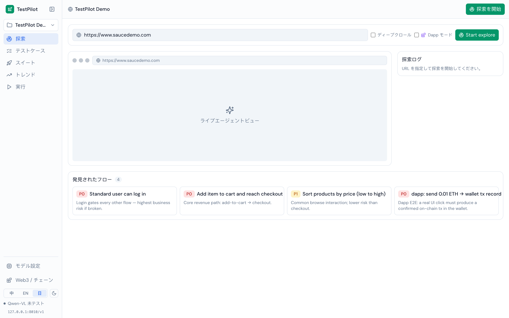

### テストケースボード
P0/P1/P2 のボード。各ケースは自然言語ステップ、期待アサーション、データ駆動バインド、Web3 実行モード、オンチェーンアサーション、生成コード、隔離トグル、そして直近の実行結果をインラインで持ちます。

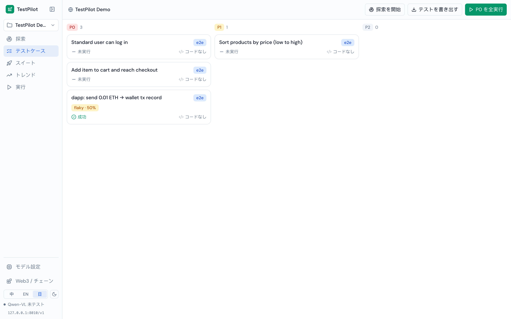

### ⛓ Dapp / オンチェーンアサーション（目玉）
ケースは**注入型仮想ウォレット**で実行し、**オンチェーンアサーション**を付けられます。下図: 実 UI の「Send 0.01 ETH」を 1 回クリック → 「ウォレットが成功トランザクションを送信 ≥ 1」をアサート → receipt を照会してマイニング済みを確認 → 合格。これはユーザーの真実に最も近く、dapp の成功 UI をモデルが読む必要がありません。

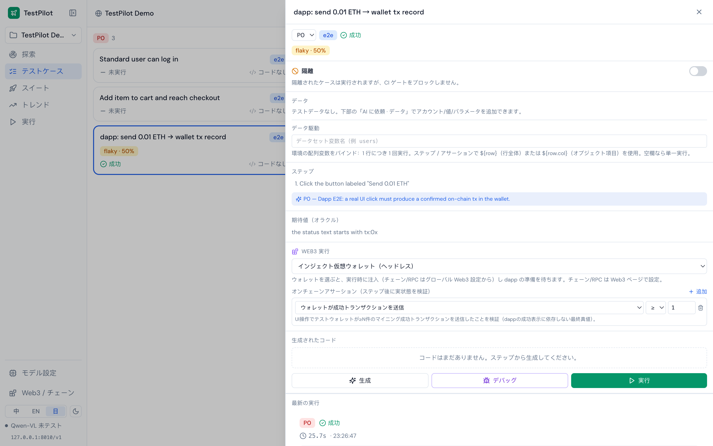

### スイートと CI ゲート
優先度で一括実行。各スイートは合格／失敗、ゲート結果（CI をブロック可能）、リトライ／修復記録を出力します。

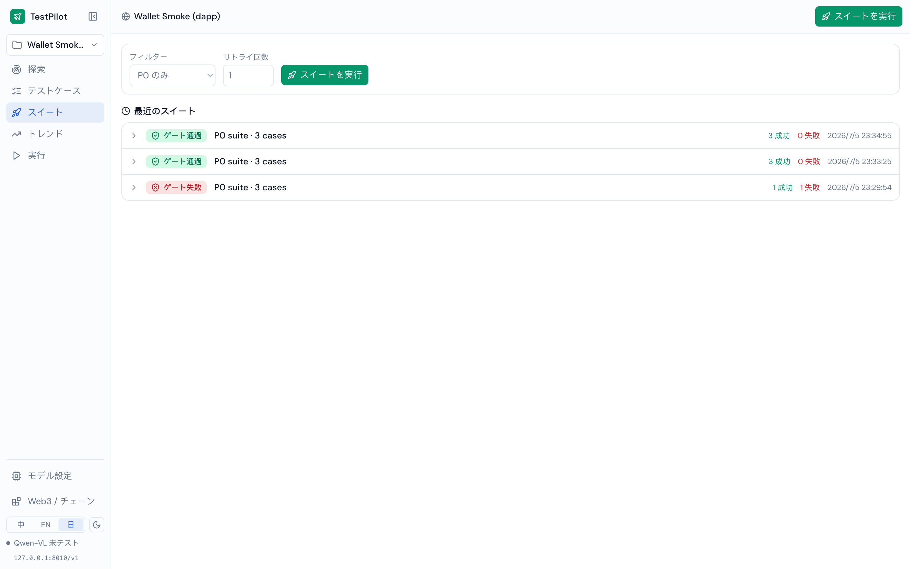

### 実行レポート
プロジェクト単位の実行台帳: 総実行数、合格率、P0 合格率、平均所要時間、実行ごとのオラクル詳細。

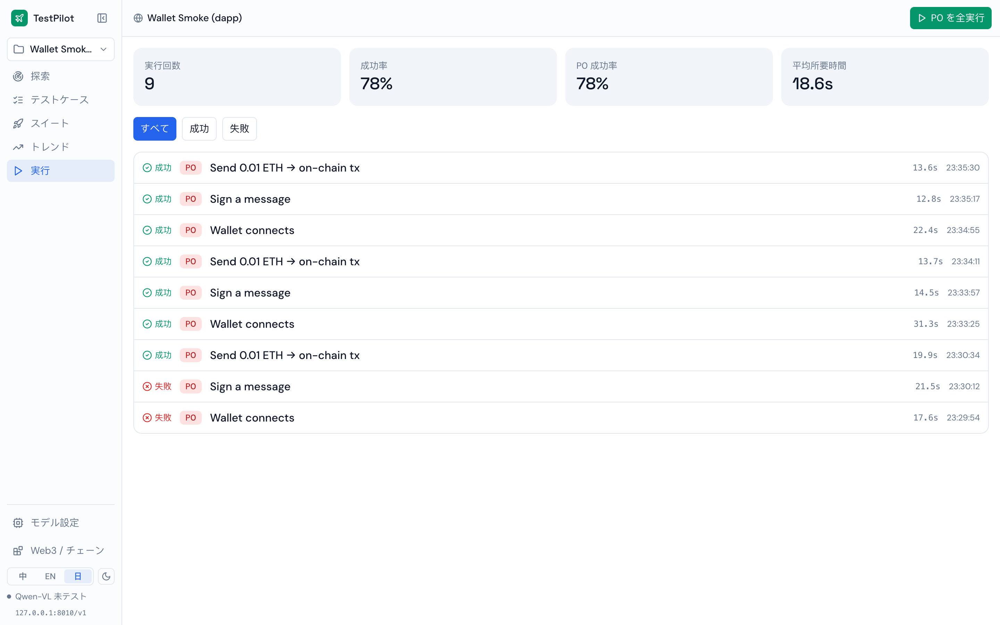

### トレンドダッシュボード
合格率の推移（緑＝ゲート合格、赤＝ゲート失敗）、フレーク率、平均修復時間、カバレッジ、修復率、スイートごとの結果分布。

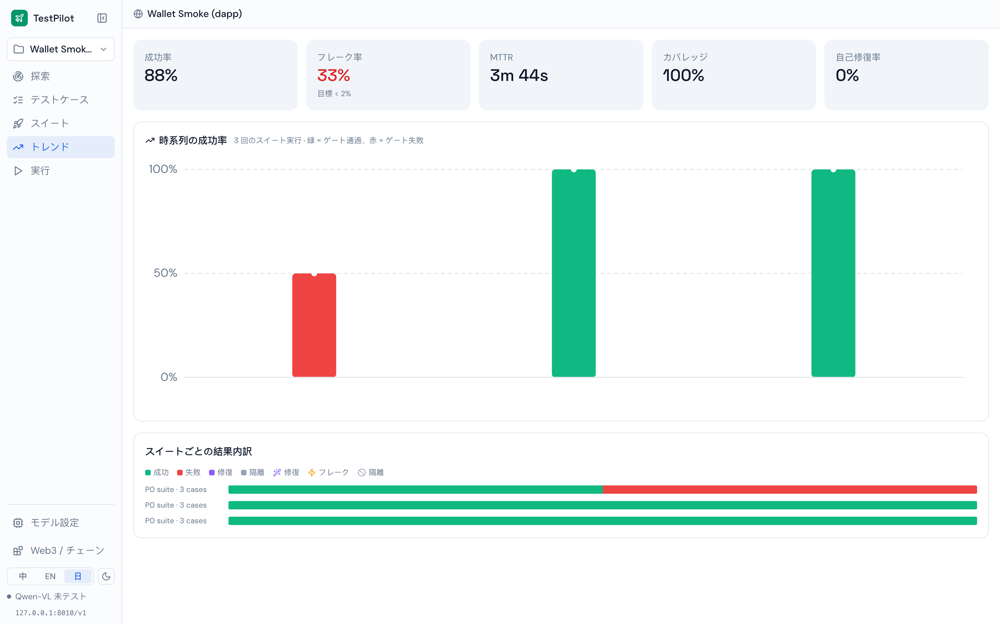

### チェーン / Dapp 設定
テストチェーン、RPC、ウォレットを専用パネルに: ローカル Anvil フォーク／Tenderly Virtual TestNet／パブリックテストネットのプリセット、管理下のテストウォレット、注入ウォレットのワンクリック実検証、そして「dapp のテスト方法」ガイドと Uniswap の例。

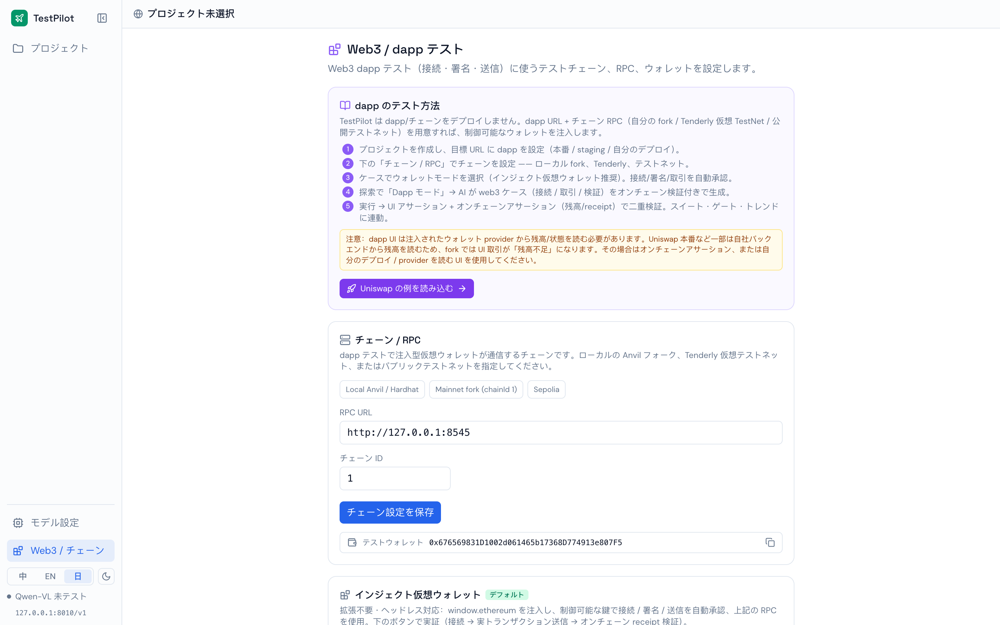

### モデル設定
セルフホストの OpenAI 互換な視覚言語エンドポイントを接続: Base URL、API キー、モデル名、モデルファミリー、エンドポイントプレビューとコピー可能な環境変数。

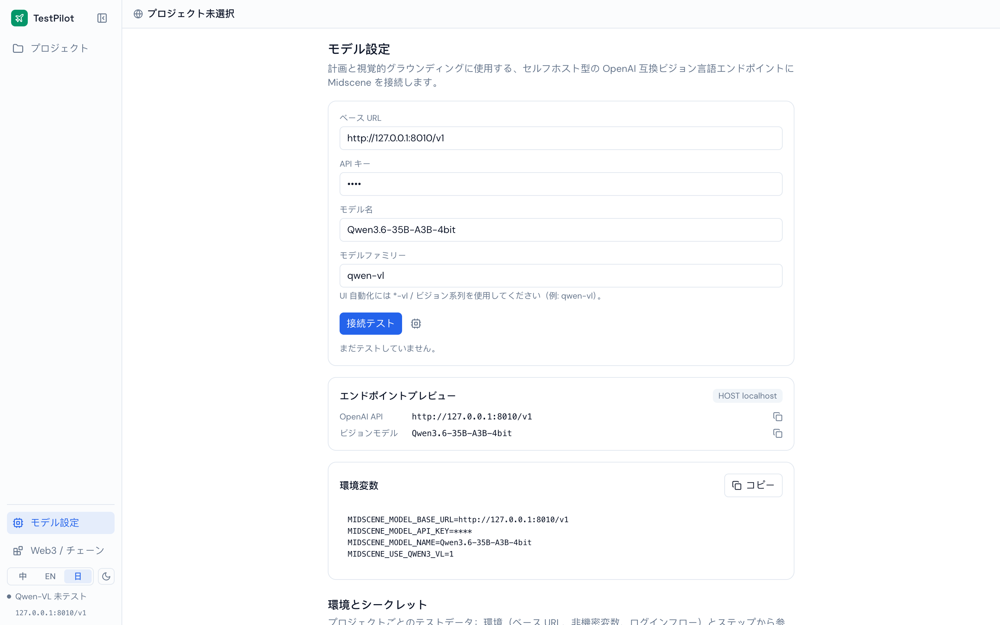

---

## アーキテクチャ

TestPilot = フロント（Rsbuild/React）＋ バックエンド（Express/SQLite）＋ 実行エンジン（Midscene がブラウザを操作 ＋ 注入ウォレット ＋ オンチェーンアサーション）＋ セルフホストの視覚言語モデル ＋ テストチェーン。

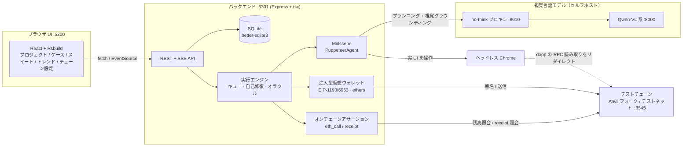

**ポイント:** Midscene は **UI 自動化のみ**を担当（拡張も改造もしない）。TestPilot はその外側に「注入ウォレット ＋ オンチェーンアサーション」層をラップします。注入モードでは我々が**ウォレットそのもの** — トランザクションが送られる源で hash を記録し、チェーンのポーリングやウォレットの監視は不要です。

---

## 実行パイプライン

1 回の実行の流れと、失敗の分類／自己修復:

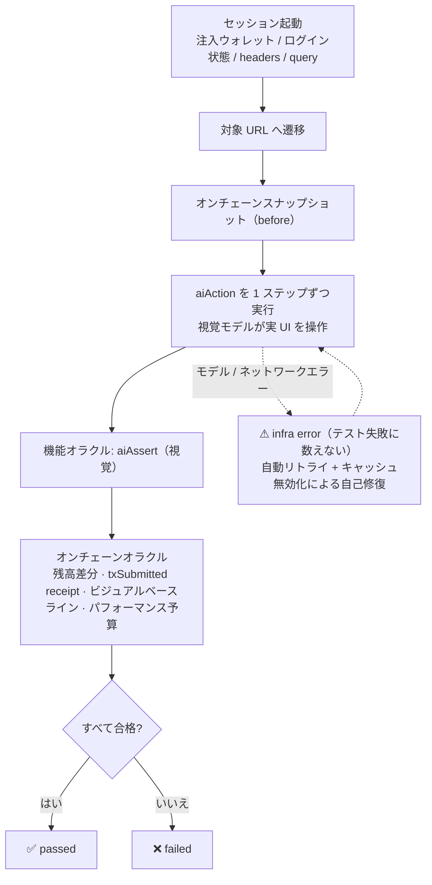

機能アサーション（視覚モデル）は脆い部分。オンチェーン／ピクセル／パフォーマンスのチェックは決定的な真実です。両方がゲートに関与し、「UI 操作の信頼性」と「結果判定」を分離します。

---

## Dapp / Web3 テスト

**原則: UI をバイパスしない。** ユーザーは dapp の画面を操作し、その操作は最終的にウォレットのトランザクションが 1 件増える形で現れます。TestPilot は最新の主流手法（Synpress-mock / Dappwright）に従い、EIP-1193/6963 プロバイダを注入して「接続／署名／トランザクション」のポップアップを自動承認します。dapp 自身の UI は最後まで実際にクリックされます。

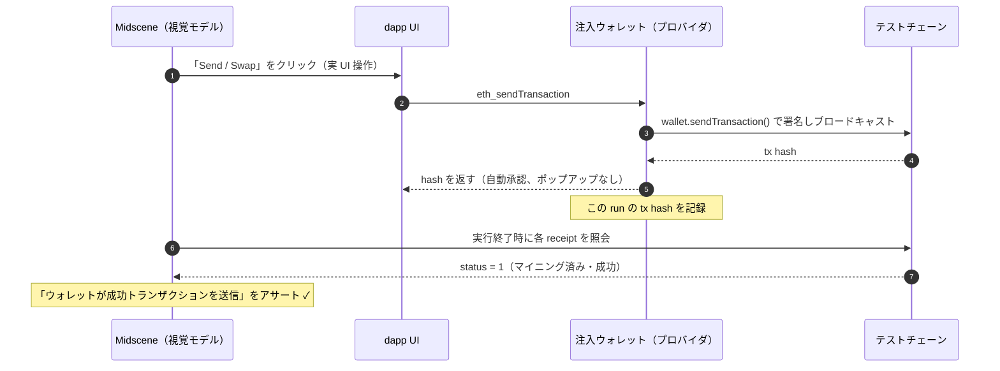

**オンチェーンアサーションの種類:** `残高 増加／減少／変化`、`残高 ≥ / ≤ / = しきい値`（ERC-20 またはネイティブ）、`ウォレットが ≥N 件の成功トランザクションを送信（txSubmitted）`。これらは**決定的な RPC 呼び出しで、LLM を使いません** — したがって最も信頼できる判定です。視覚アサーションは UI 層のバックアップに過ぎません。

**自分の dapp をテストする:** TestPilot は dapp をデプロイしません。dapp の URL ＋ チェーン RPC（ローカルフォーク／Tenderly／テストネット）を渡すと、管理下のウォレットを注入して接続します。リポジトリには `/testdapp`（接続／署名／送信／WETH wrap）が同梱され、すぐ検証できます。チェーン設定ページには Uniswap の例とガイドもあります。

> ⚠️ **本番 Uniswap について:** そのフロントは残高を自社バックエンドのゲートウェイから読み取り（フォークには見えません）、UI も非常に密集しているため、**セルフホストの 35B モデル**では安定して操作するのが困難です。これは**モデル能力の軸**の問題であり、プラットフォーム設計の問題ではありません: `MIDSCENE_MODEL_*` をより強力な視覚モデルに向ければ動作します。オンチェーンアサーション層はモデルに依存しません。同梱の `/testdapp` ケース（接続／署名／送信 ＋ オンチェーンアサーション）はローカルモデルでも安定して全緑になります。

---

## AI モデル依存

TestPilot はページのプランニングと視覚グラウンディングに、**OpenAI 互換の視覚言語（VL）エンドポイント**を必要とします。既定の検証済み構成:

| 項目 | 値 |
|---|---|
| モデル | **Qwen3.6-35B-A3B-4bit**（Qwen3-VL 系、セルフホスト、例: MLX / vLLM） |
| エンドポイント | `http://127.0.0.1:8010/v1`（no-think プロキシ。生モデルは `:8000`） |
| モデルファミリーフラグ | `MIDSCENE_USE_QWEN3_VL=1`（Qwen2.5-VL は `MIDSCENE_USE_QWEN_VL=1`） |
| キャッシュ | `MIDSCENE_CACHE=1`（ケースごとにプランをキャッシュし、回帰再実行はモデルなしで再生） |

「モデル設定」ページで視覚的に設定するか、環境変数（`server/.env`）で設定します:

```bash
MIDSCENE_MODEL_BASE_URL=http://127.0.0.1:8010/v1
MIDSCENE_MODEL_API_KEY=your-key
MIDSCENE_MODEL_NAME=Qwen3.6-35B-A3B-4bit
MIDSCENE_USE_QWEN3_VL=1
```

**任意の VL モデルに差し替え:** エンドポイントが OpenAI 互換で、モデルが視覚グラウンディングに対応していれば（Qwen-VL、あるいはより強力なフロンティアモデル）、上記 3 値を向けるだけです。モデルが強いほど、Uniswap のような密集 UI もうまく操作できます。

> 🧠 **メモリの注意:** VRAM/RAM が限られたマシンで大きな VL モデルを動かす場合、ページの DOM が大きいほどプロンプトが大きくなり、メモリガードに掛かりやすくなります。TestPilot はスクリーンショットのビューポートをダウンサンプリング（`MIDSCENE_SHOT_WIDTH/HEIGHT`、既定 1024×720）してプロンプトを小さく保ちます。それでも足りない場合は、VRAM の大きいマシンか小さいモデルを使ってください。

---

## ローカル開発

### 前提条件

- **Node.js ≥ 20**（22 で検証済み）と **pnpm**
- **OpenAI 互換の視覚言語エンドポイント**（上記参照）
- （dapp テスト用、任意）ローカルチェーンやフォークを起動する **Foundry / anvil**

### 1) インストール

```bash
# フロント（リポジトリルート）
pnpm install

# バックエンド
cd server && pnpm install && cd ..
```

### 2) モデルを設定（バックエンド）

```bash
# server/.env を編集し、MIDSCENE_MODEL_* エンドポイントを設定（「AI モデル依存」参照）
```

### 3) サービスを起動

```bash
# ターミナル A — バックエンド API (:5301)
cd server && pnpm dev

# ターミナル B — フロント (:5300)
pnpm dev
```

**http://localhost:5300** を開きます。

### 4)（任意）Dapp テスト: テストチェーンを起動

```bash
cd server
pnpm gen:wallet          # 管理下のテストウォレットを生成（.wallets/seed.txt）
pnpm chain               # ローカル Anvil（chainId 31337）
# またはメインネットをフォーク:
pnpm fork                # anvil --fork-url ...（chainId 1）
```

「チェーン / Dapp 設定」ページで RPC を `http://127.0.0.1:8545` に向け、注入ウォレットで dapp ケースを実行します。

### ポート一覧

| ポート | サービス |
|---|---|
| `5300` | フロント（Rsbuild dev） |
| `5301` | バックエンド API ＋ 同梱の `/testdapp` |
| `8010` | モデル no-think プロキシ |
| `8000` | 生の VL モデル |
| `8545` | テストチェーン（Anvil / フォーク） |

### よく使うスクリプト

```bash
pnpm typecheck                 # フロントの型チェック
cd server && pnpm typecheck    # バックエンドの型チェック
pnpm build                     # フロント本番ビルド → dist/
```

---

## 技術スタック

| レイヤー | 採用 |
|---|---|
| ビルド / バンドル | **Rsbuild**（Rspack, Rust コア）＋ **SWC** トランスパイル |
| フロント | React 18 · TypeScript · react-router v6（hash ルータ）· Zustand · Tailwind v3 · lucide-react |
| バックエンド | Express · tsx · **better-sqlite3**（組み込み SQLite）· cors · dotenv |
| 自動化エンジン | **@midscene/web**（PuppeteerAgent）· Puppeteer（ヘッドレス Chrome） |
| Web3 | **ethers v6**（注入ウォレットの署名／送信）· EIP-1193 / EIP-6963 プロバイダ |
| ビジュアル差分 / パフォーマンス | pixelmatch · pngjs · Puppeteer パフォーマンス指標 |
| モデル | セルフホスト Qwen-VL（OpenAI 互換）· no-think プロキシ |
| i18n | 中／英／日 辞書 ＋ モデルへ渡す言語制約 |

---

## ディレクトリ構成

```
testpilot/
├── src/                    # フロント（React + Rsbuild）
│   ├── pages/              # Projects / Explore / CasesBoard / Suite / Trends / RunReport / ModelConfig / ChainConfig
│   ├── components/         # Layout / Sidebar / 基本コンポーネント
│   └── lib/                # store（zustand）· api · types · i18n · prefs
├── server/                 # バックエンド（Express + tsx）
│   └── src/
│       ├── index.ts        # API ＋ 実行エンジン（executeRun / スイート / 探索 SSE）
│       ├── agent.ts        # launchSession: Midscene ＋ 注入ウォレット ＋ ログイン状態/headers/query
│       ├── injectedWallet.ts  # EIP-1193/6963 注入型仮想ウォレット
│       ├── chain.ts        # オンチェーンアサーション（残高 / txSubmitted receipt）
│       ├── db.ts           # SQLite スキーマとマイグレーション
│       ├── config.ts       # モデル / チェーン / ビューポートの解決
│       └── settings.ts     # 探索メソドロジーの prompt / 言語制約
├── docs/screenshots/       # この README 用スクリーンショット（zh / en / ja）
└── README.md               # 中国語（既定）· README.en.md · README.ja.md
```

---

## ロードマップ

- **P1** — 実際の MetaMask ポップアップモードを実行パイプラインに統合（実ポップアップ UX をテストしたいチーム向け）
- **P2** — オンチェーンアサーションの拡充: nonce/txCount、イベントログ、ERC-20 allowance、ERC-721 owner
- 複雑な本番級 dapp UI を操作するための、より強力な視覚モデル統合と Midscene プランキャッシュ

---

<p align="center">
  <sub>Midscene で駆動 · 部門の自動テストを AI に任せるために。</sub>
</p>
