<p align="center">
  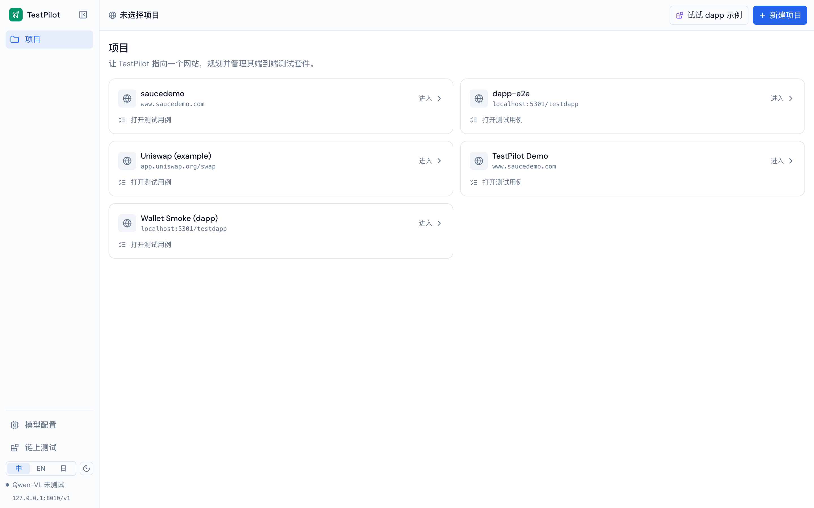
</p>

<h1 align="center">TestPilot</h1>

<p align="center">
  <b>AI 驱动的端到端测试平台 —— 面向 Web 应用与 Web3 dapp。</b><br>
  给一个网址，AI 探索出用例、驱动真实 UI 跑测、并给出确定性判定。
</p>

<p align="center">
  <a href="README.md"></a>
  <a href="README.en.md"></a>
  <a href="README.ja.md"></a>
</p>

<p align="center">
  
  
  
  
</p>

---

## 目录

- [TestPilot 是什么](#testpilot-是什么)
- [核心能力](#核心能力)
- [功能一览（含截图）](#功能一览含截图)
- [架构](#架构)
- [运行流水线](#运行流水线)
- [Dapp / Web3 测试](#dapp--web3-测试)
- [AI 模型依赖](#ai-模型依赖)
- [本地运行与开发](#本地运行与开发)
- [技术栈](#技术栈)
- [项目结构](#项目结构)
- [路线图](#路线图)

---

## TestPilot 是什么

TestPilot 把「一个部门的自动化测试工作」交给 AI 来做：

1. **探索** —— 输入一个网址，视觉语言模型自动理解页面，产出带 **P0/P1/P2 优先级**与业务理由的用例。
2. **执行** —— 用 [Midscene](https://midscenejs.com/) 驱动**真实浏览器**，用自然语言步骤操作真实 UI（不写选择器）。
3. **判定** —— 每次运行走「**功能断言（视觉）+ 链上/性能/视觉基线断言（确定性）**」双重 oracle，给出可信结论。
4. **治理** —— 套件运行、CI 门禁、自愈重试、抖动（flaky）统计、趋势看板、可运行代码导出。

与传统「录制脚本 / 手写选择器」相比，用例用自然语言表达，**页面小改动不再批量失效**；判定尽量落在确定性信号（链上回执、像素基线、性能预算）上，把脆弱的视觉判断和可靠的结果判断解耦。

> **特别聚焦 Web3 dapp E2E**：用户和 dapp 的 UI 交互，最终真值是「钱包里多了一条成功交易」。TestPilot 用注入式虚拟钱包自动确认钱包弹窗，并把这条 tx 回执做成一等断言 —— 全程不绕过 UI。

---

## 核心能力

| 能力 | 说明 |
|---|---|
| 🧭 **AI 探索** | 视觉模型理解站点 → 生成带优先级/理由的用例；支持深度爬取与「Dapp 模式」 |
| ⌨️ **自然语言用例** | 步骤 = 人话（"点击 Send 0.01 ETH"），无需 CSS 选择器 |
| ✅ **双重 oracle** | 功能断言（`aiAssert`）+ 链上断言 / 视觉基线 diff / 性能预算 |
| ⛓ **Dapp / 链上断言** | 注入式钱包自动确认弹窗；断言余额增减、**钱包发出成功交易（回执 status=1）** |
| 🔁 **套件 · 门禁 · 自愈** | 并发队列、失败重试、缓存失效自愈、CI 门禁、抖动统计与隔离 |
| 🖼 **视觉 / 性能基线** | 逐步像素级 diff（三联图 + 批准为基线）；TTFB/FCP/DCL/Load 性能预算与回归标记 |
| 🐞 **用例调试** | 实时 SSE 逐步回放 + 意图优先的 AI 修正（改步骤/断言，先预览 diff 再落盘） |
| 📊 **趋势看板** | 通过率、抖动率、平均修复时间、覆盖率、自愈率 |
| 🔐 **环境与密钥** | 每项目的环境变量、加密密钥、登录态（API 登录 / cookie / storageState） |
| 🧬 **数据驱动** | 绑定数据集，每行数据跑一次（`${row}` / `${row.列}`） |
| 📤 **代码导出** | 一键导出可运行的 Playwright 工程（含环境/密钥/登录态/CI） |
| 🌐 **三语 + 暗色** | 中 / 英 / 日；语言会一并传给模型，约束返回语言 |

---

## 功能一览（含截图）

### 项目组合
把 TestPilot 指向多个网站，各自管理一套端到端测试。两级导航：项目组合（Level 0）↔ 项目内（Level 1）。


### AI 探索
输入 URL → 模型实时截图理解页面 → 产出「已发现的流程」（带优先级与业务理由）。支持深度爬取与 Dapp 模式。

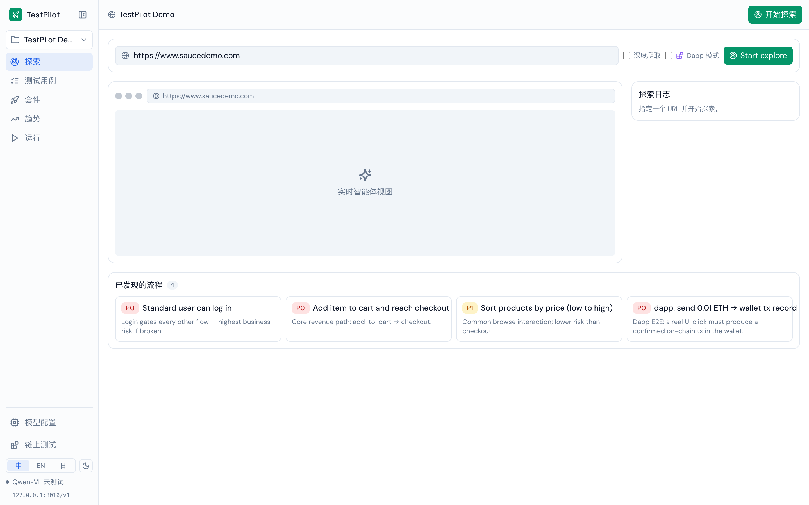

### 测试用例看板
P0/P1/P2 看板。每个用例含自然语言步骤、预期断言、数据驱动、Web3 运行模式、链上断言、生成代码、隔离开关，以及内嵌的最近一次运行结果。

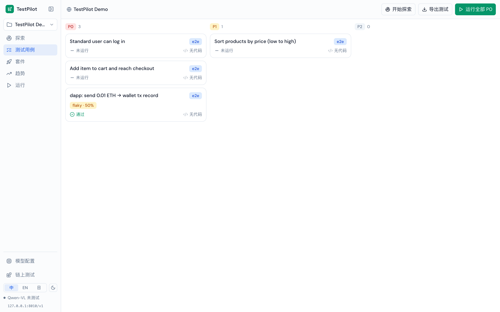

### 🐞 用例调试（实时）
选中用例点「调试」→ 打开实时调试：用例每一步以 SSE 流式回放，右侧是被测页面的实时截图（dapp 用例会自动注入钱包，`provider:present`）。哪一步失败一目了然；可用**意图优先**的「让 AI 修正」—— 先声明你要改「步骤」还是「断言」，预览 diff 后再落盘并重跑。

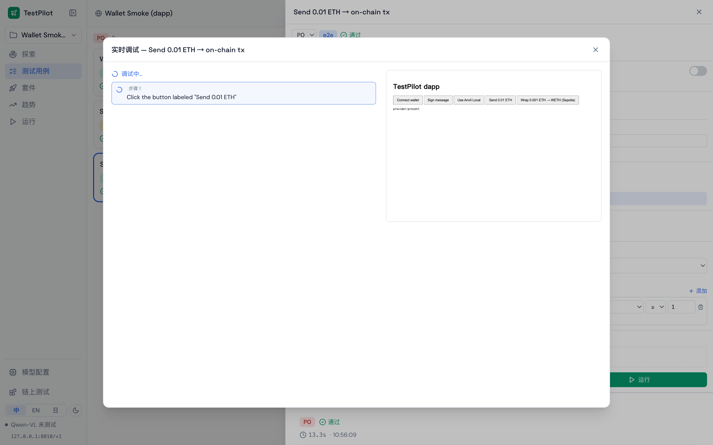

### ⛓ Dapp / 链上断言（重点）
用例可选**注入式虚拟钱包**运行，并附带**链上断言**。下图这条用例：点一下真实 UI 的「Send 0.01 ETH」→ 断言「钱包发出成功交易 ≥ 1」→ 查回执确认已上链，判定通过。这是最贴近用户的真值，且不依赖模型去读 dapp 的成功提示。

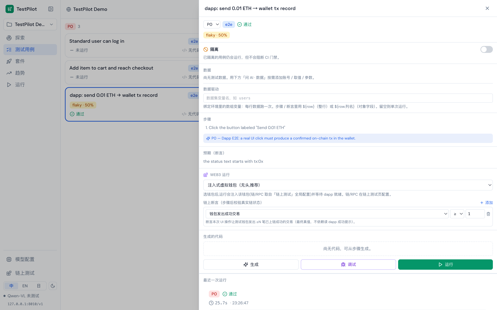

### 套件与 CI 门禁
按优先级批量运行；每次套件产出通过/失败、门禁结果（可挡 CI）、重试与自愈记录。

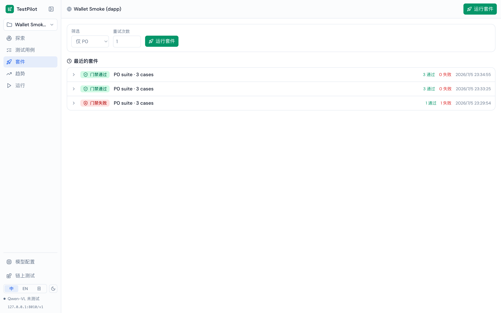

### 运行报告
项目级运行台账：总运行数、通过率、P0 通过率、平均耗时，以及每次运行的 oracle 明细。

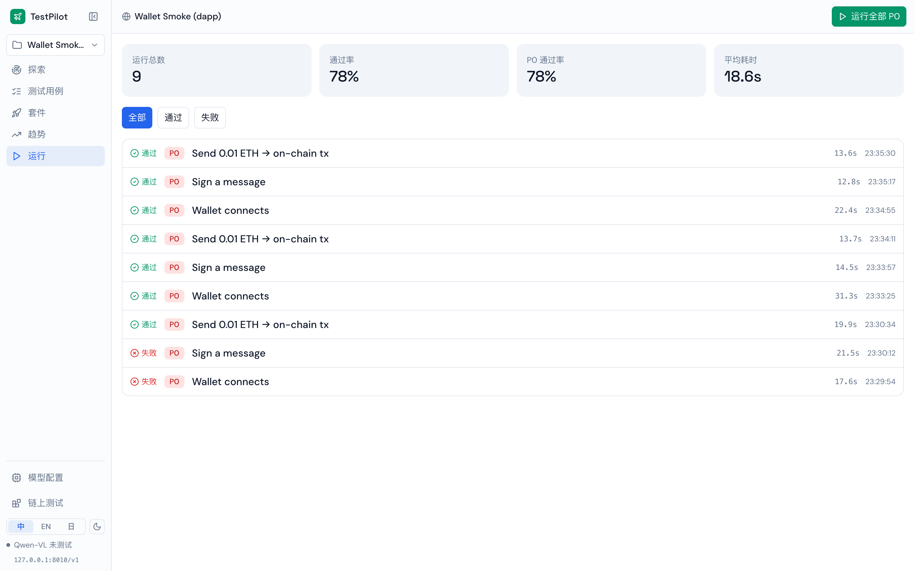

### ⏱ 性能基线
每次运行采集 TTFB / FCP / DCL / Load，与基线逐项对比并算出 Δ%；超预算标红为「回归」，首次运行自动建立基线。

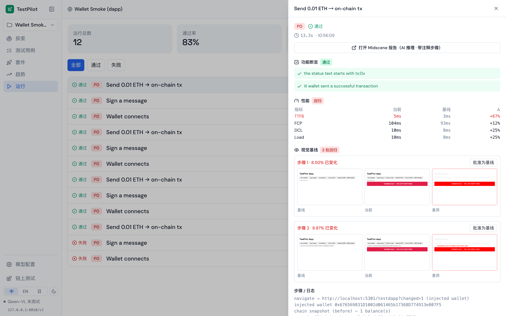

### 🖼 视觉基线
逐步截图与基线做像素级 diff（pixelmatch），给出「基线 ｜ 当前 ｜ 差异」三联图与不一致百分比。确认是预期变化就「批准为基线」，一键更新基线。

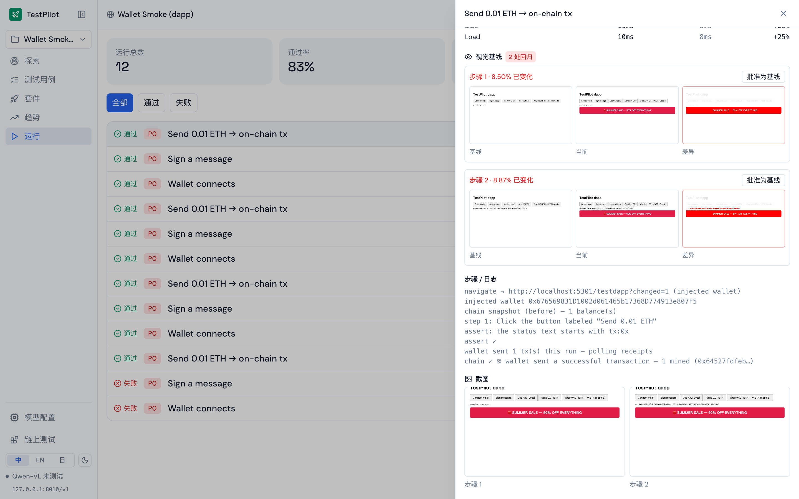

### 趋势看板
通过率随时间变化（绿=门禁通过，红=门禁失败）、抖动率、平均修复时间、覆盖率、自愈率，以及各套件结果分布。

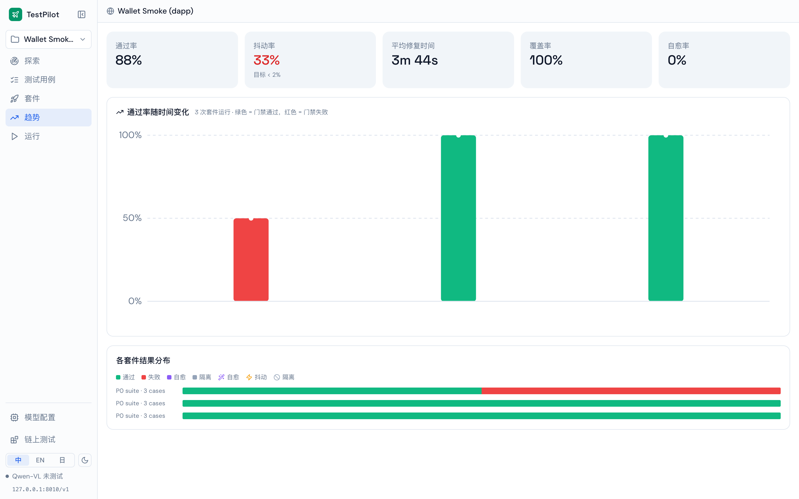

### 链上 / Dapp 配置
把测试链、RPC、钱包单拉一个配置面板：本地 Anvil 分叉 / Tenderly 虚拟测试网 / 公共测试网预设，受控测试钱包，注入式钱包一键真实验证，还有「如何测一个 dapp」的指引与 Uniswap 示例。

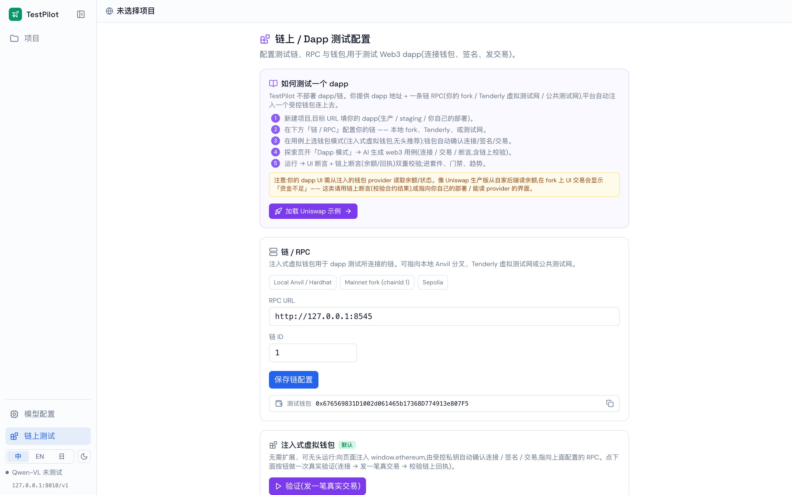

### 模型配置
接入自托管、兼容 OpenAI 的视觉语言端点：Base URL、API Key、模型名、模型系列，端点预览与可复制的环境变量。

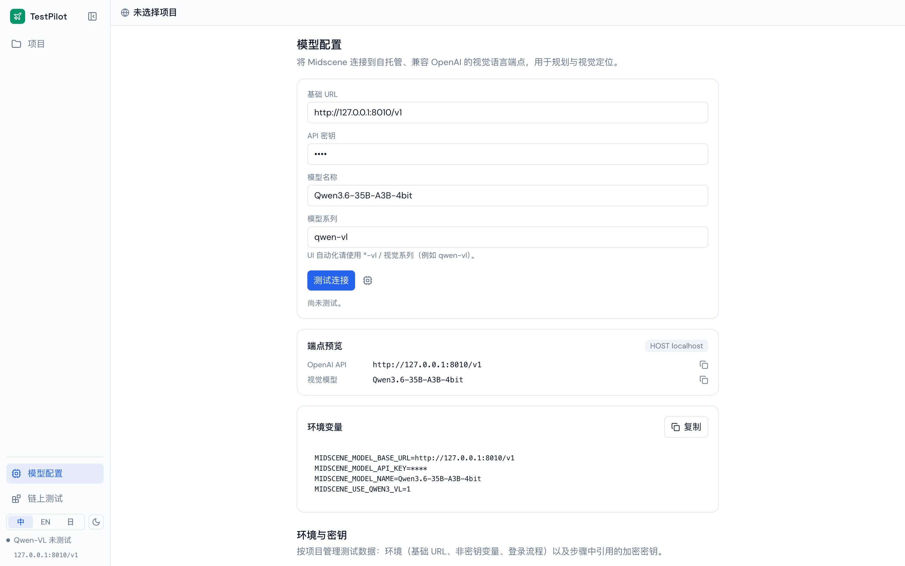

---

## 架构

TestPilot = 前端（Rsbuild/React）+ 后端（Express/SQLite）+ 运行引擎（Midscene 驱浏览器 + 注入钱包 + 链上断言）+ 一个自托管视觉语言模型 + 一条测试链。

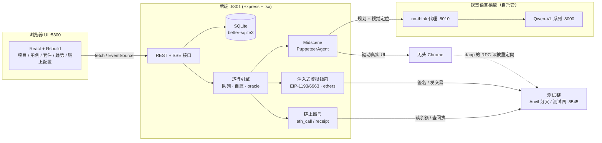

**关键点**：Midscene 只负责 **UI 自动化**（不被扩展、不被改造）；TestPilot 在它外面包了「注入钱包 + 链上断言」层。注入模式下我们**就是钱包** —— 在交易发出的源头记录 hash，无需轮询链或监听钱包。

---

## 运行流水线

一次运行如何走完，以及失败如何被分类/自愈：

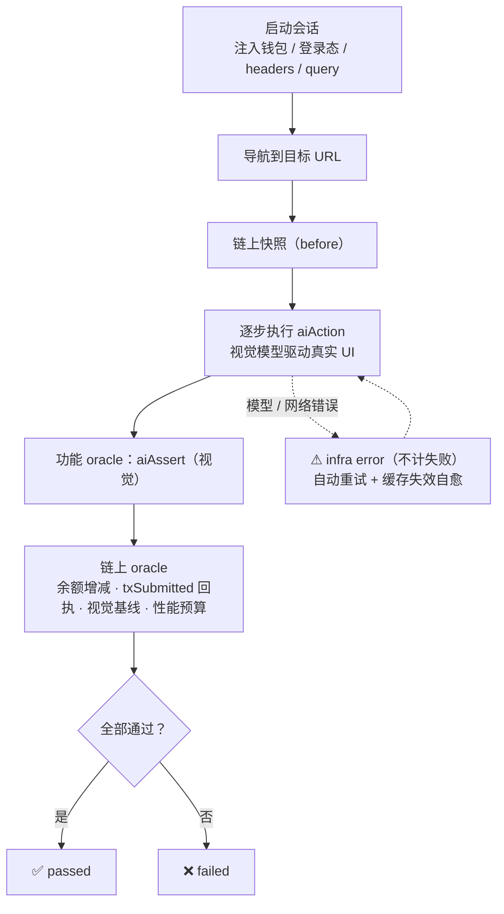

功能断言（视觉模型）是相对脆弱的一环；链上/像素/性能断言是确定性的真值。二者都参与门禁，把「UI 驱动可靠性」和「结果判定」解耦。

---

## Dapp / Web3 测试

**原则：不绕过 UI。** 用户就是和 dapp 的界面交互；UI 上的操作最终反映为钱包里多一条交易。TestPilot 的做法与业内主流（Synpress-mock / Dappwright）一致 —— 注入一个 EIP-1193/6963 provider，自动确认「连接 / 签名 / 交易」弹窗，dapp 自己的界面全程真实点击。

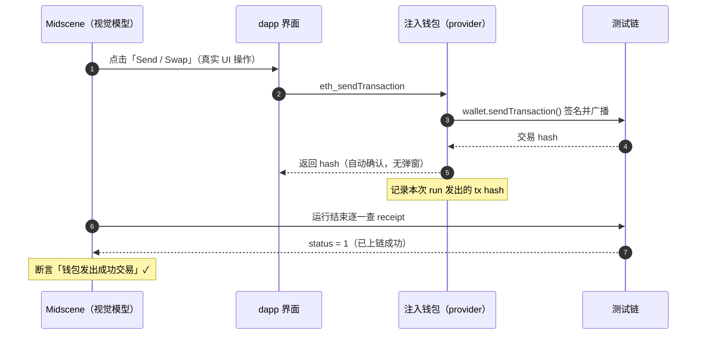

**链上断言类型**：`余额增/减/变化`、`余额 ≥ / ≤ / = 阈值`（ERC-20 或原生）、`钱包发出 ≥N 笔成功交易（txSubmitted）`。这些是**确定性 RPC 调用，不走大模型** —— 因此是最可靠的判定；视觉断言只用来兜底 UI 层。

**测你自己的 dapp**：TestPilot 不部署 dapp。你提供 dapp 地址 + 一条链 RPC（本地 fork / Tenderly / 测试网），平台注入一个受控钱包连上去。仓库内置 `/testdapp`（连接 / 签名 / 发交易 / WETH wrap）可开箱验证，链上配置页也带 Uniswap 示例与指引。

> ⚠️ **关于 Uniswap 生产版**：它的前端从自家后端网关读余额（在 fork 上看不到），且 UI 非常密集 —— 用**自托管的 35B 小模型**难以稳定驱动。这是**模型能力轴**的问题，不是平台设计问题：换更强的视觉模型（把 `MIDSCENE_MODEL_*` 指过去）即可，链上断言层与模型无关。内置 `/testdapp` 用例（连接 / 签名 / 发交易 + 链上断言）在本地模型下即可稳定全绿。

---

## AI 模型依赖

TestPilot 依赖一个**兼容 OpenAI 的视觉语言（VL）端点**来做页面规划与视觉定位。默认与验证过的配置：

| 项 | 值 |
|---|---|
| 模型 | **Qwen3.6-35B-A3B-4bit**（Qwen3-VL 系列，自托管，如 MLX / vLLM） |
| 端点 | `http://127.0.0.1:8010/v1`（no-think 代理；原始模型在 `:8000`） |
| 模型系列标记 | `MIDSCENE_USE_QWEN3_VL=1`（Qwen2.5-VL 用 `MIDSCENE_USE_QWEN_VL=1`） |
| 缓存 | `MIDSCENE_CACHE=1`（每用例缓存规划，回归复用、无需再调模型） |

在页面「模型配置」里可视化设置，或用环境变量（`server/.env`）：

```bash
MIDSCENE_MODEL_BASE_URL=http://127.0.0.1:8010/v1
MIDSCENE_MODEL_API_KEY=your-key
MIDSCENE_MODEL_NAME=Qwen3.6-35B-A3B-4bit
MIDSCENE_USE_QWEN3_VL=1
```

**换任意 VL 模型**：只要端点兼容 OpenAI 且模型支持视觉定位（Qwen-VL、或更强的前端模型），把上面三个值指过去即可。模型越强，越能驱动 Uniswap 这类密集 UI。

> 🧠 **内存提示**：在显存/内存受限的机器上跑大 VL 模型，页面 DOM 越大、prompt 越大越容易触发内存保护。TestPilot 已把截图视口降采样（`MIDSCENE_SHOT_WIDTH/HEIGHT`，默认 1024×720）来压小 prompt；仍不足时可换更大显存的机器或更小的模型。

---

## 本地运行与开发

### 前置条件

- **Node.js ≥ 20**（已在 22 上验证）与 **pnpm**
- 一个**兼容 OpenAI 的视觉语言端点**（见上）
- （dapp 测试可选）**Foundry / anvil** 起一条本地链或 fork

### 1) 安装

```bash
# 前端（仓库根）
pnpm install

# 后端
cd server && pnpm install && cd ..
```

### 2) 配置模型（后端）

```bash
# 编辑 server/.env，填入你的 MIDSCENE_MODEL_* 端点（见「AI 模型依赖」）
```

### 3) 起服务

```bash
# 终端 A —— 后端接口 (:5301)
cd server && pnpm dev

# 终端 B —— 前端 (:5300)
pnpm dev
```

打开 **http://localhost:5300** 。

### 4)（可选）Dapp 测试：起一条测试链

```bash
cd server
pnpm gen:wallet          # 生成受控测试钱包（.wallets/seed.txt）
pnpm chain               # 本地 Anvil（chainId 31337）
# 或分叉主网：
pnpm fork                # anvil --fork-url ...（chainId 1）
```

在「链上 / Dapp 配置」页把 RPC 指向 `http://127.0.0.1:8545`，即可用注入式钱包跑 dapp 用例。

### 端口一览

| 端口 | 服务 |
|---|---|
| `5300` | 前端（Rsbuild dev） |
| `5301` | 后端接口 + 内置 `/testdapp` |
| `8010` | 模型 no-think 代理 |
| `8000` | 原始 VL 模型 |
| `8545` | 测试链（Anvil / fork） |

### 常用脚本

```bash
pnpm typecheck                 # 前端类型检查
cd server && pnpm typecheck    # 后端类型检查
pnpm build                     # 前端生产构建 → dist/
```

---

## 技术栈

| 层 | 选型 |
|---|---|
| 构建 / 打包 | **Rsbuild**（Rspack, Rust 内核）+ **SWC** 转译 |
| 前端 | React 18 · TypeScript · react-router v6（hash 路由）· Zustand · Tailwind v3 · lucide-react |
| 后端 | Express · tsx · **better-sqlite3**（内嵌 SQLite）· cors · dotenv |
| 自动化引擎 | **@midscene/web**（PuppeteerAgent）· Puppeteer（无头 Chrome） |
| Web3 | **ethers v6**（注入钱包签名/发交易）· EIP-1193 / EIP-6963 provider |
| 视觉 diff / 性能 | pixelmatch · pngjs · Puppeteer 性能指标 |
| 模型 | 自托管 Qwen-VL（兼容 OpenAI）· no-think 代理 |
| i18n | 中 / 英 / 日 字典 + 语言约束下发给模型 |

---

## 项目结构

```
testpilot/
├── src/                    # 前端（React + Rsbuild）
│   ├── pages/              # Projects / Explore / CasesBoard / Suite / Trends / RunReport / ModelConfig / ChainConfig
│   ├── components/         # Layout / Sidebar / 基础组件
│   └── lib/                # store(zustand) · api · types · i18n · prefs
├── server/                 # 后端（Express + tsx）
│   └── src/
│       ├── index.ts        # 接口 + 运行引擎（executeRun / 套件 / 探索 SSE）
│       ├── agent.ts        # launchSession：Midscene + 注入钱包 + 登录态/headers/query
│       ├── injectedWallet.ts  # EIP-1193/6963 注入式虚拟钱包
│       ├── chain.ts        # 链上断言（余额 / txSubmitted 回执）
│       ├── db.ts           # SQLite 模型与迁移
│       ├── config.ts       # 模型 / 链 / 视口解析
│       └── settings.ts     # 探索方法学 prompt / 语言约束
├── docs/screenshots/       # 本 README 用截图（zh / en / ja）
└── README.md               # 你在这里
```

---

## 路线图

- **P1** —— 真 MetaMask 弹窗模式接进运行管线（给需要测真实弹窗 UX 的团队）
- **P2** —— 更多链上断言：nonce/txCount、事件日志、ERC-20 授权额度、ERC-721 owner
- 更强视觉模型接入与 Midscene 计划缓存，用于驱动复杂生产级 dapp UI

---

<p align="center">
  <sub>用 Midscene 驱动 · 为把一个部门的自动化测试交给 AI 而生。</sub>
</p>
